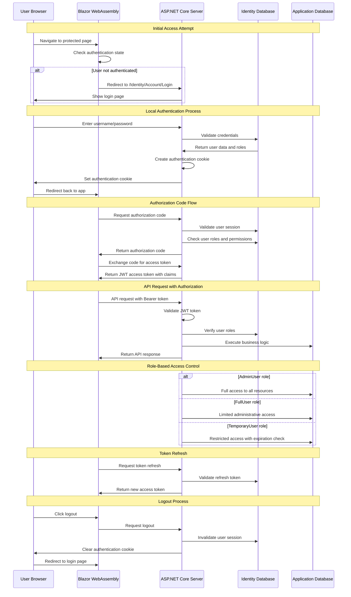

# Casimo Application Authorization Flow

This diagram shows the complete authorization flow for the Casimo application, which uses OpenID Connect with ASP.NET Core Identity and Blazor WebAssembly.

## Architecture Overview

The application consists of:
- **Blazor WebAssembly Client** (Casimo.Web) - Frontend SPA
- **ASP.NET Core Server** (Casimo.Server) - Backend API and Identity Server
- **Identity Database** (AuthDBContext) - User authentication data
- **Application Database** (CasimoDbContext) - Business data
- **Local Authentication** - ASP.NET Core Identity with local user accounts

## User Roles and Policies

### Roles
- **AdminUser** - Full system access
- **FullUser** - Limited administrative access  
- **TemporaryUser** - Restricted access with expiration

### Authorization Policies
- **AdminPolicy** - Requires AdminUser role
- **FullUserPolicy** - Requires AdminUser OR FullUser role
- **TemporaryUserPolicy** - Requires TemporaryUser role

## Authorization Flow Diagram

## Key Components

### 1. Authentication Controllers
- **AuthenticationController** - Handles OAuth callbacks (currently configured for local authentication)
- **AuthorizationController** - Manages OpenID Connect authorization and token endpoints

### 2. Identity Configuration
- **OpenIddict** - OAuth 2.0/OpenID Connect server
- **ASP.NET Core Identity** - User management and authentication
- **Entity Framework** - Database context for identity data

### 3. Client Configuration
- **Blazor WebAssembly** - SPA client with OIDC authentication
- **HttpClient with Authorization** - Automatic token attachment
- **Role-based UI** - Conditional rendering based on user roles

### 4. Security Features
- **PKCE (Proof Key for Code Exchange)** - Enhanced security for public clients
- **JWT Tokens** - Stateless authentication tokens
- **Role-based Authorization** - Fine-grained access control
- **Temporary User Expiration** - Time-limited access for temporary users
- **Local Authentication** - Username/password authentication with ASP.NET Core Identity
- **Cookie-based Sessions** - Secure session management with configurable expiration

## Database Schema

### Identity Tables (AuthDBContext)
- **AspNetUsers** - User accounts with custom ApplicationUser properties
- **AspNetRoles** - System roles (AdminUser, FullUser, TemporaryUser)
- **AspNetUserRoles** - User-role assignments
- **OpenIddict tables** - OAuth application and token management

### Application Tables (CasimoDbContext)
- **Facilities** - Business data requiring authorization
- **FitForPurpose** - Assessment data
- **User management** - Extended user information

## Security Considerations

1. **HTTPS Enforcement** - All communication encrypted
2. **Token Expiration** - Short-lived access tokens with refresh capability
3. **Role Validation** - Server-side role verification on each request
4. **Temporary User Management** - Automatic expiration of temporary accounts
5. **CORS Configuration** - Controlled cross-origin access
6. **Database Encryption** - Sensitive data protection
7. **Local Authentication** - No external dependencies for user authentication
8. **Cookie Security** - Secure, HTTP-only cookies with configurable expiration
9. **Password Security** - ASP.NET Core Identity password hashing and validation

This architecture provides a robust, scalable authentication and authorization system suitable for enterprise applications with multiple user types and access levels, using local authentication instead of external providers.
